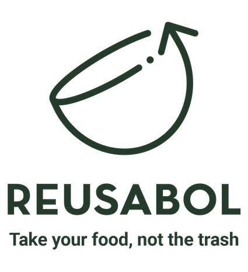
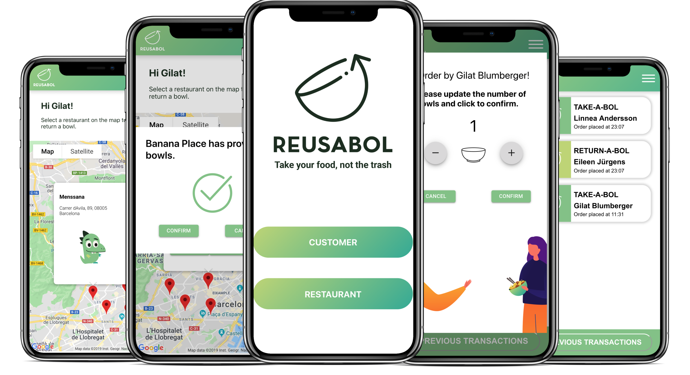
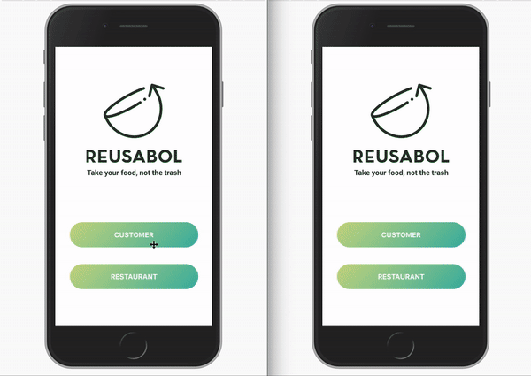

# Reusabol

<p align="center">
  
</p>

Reusabol is a circular food packaging service, implemented with a mobile-first app. The app has three interfaces: end user, restaurant and admin.

## Screenshots

<p align="center">
  
</p>

## Demo

  


## Getting started

1. Clone this repo and enter!

   ```bash
   git clone git@github.com:gilatb/Reusabol.git
   cd client
   ```

2. Install frontend dependencies and start.

   ```bash
   npm install
   npm start
   ```

3. Open a new terminal and go to the server folder

    ```bash
   cd ..
   cd server
   ```

4. Install backend dependencies and start.

   ```bash
   npm install
   npm start
   ```


## Tech Stack

* [React.js](https://reactjs.org)
* [Redux](https://redux.js.org/) 
* [Express.js](https://expressjs.com/)
* [MongoDB](https://www.mongodb.com/) 
* [Mongoose](https://mongoosejs.com/) 
* [Maps JavaScript API](https://developers.google.com/maps/documentation/javascript/tutorial)

## Developers Team

* Gilat Blumberger - [GitHub](https://github.com/gilatb) - [LinkedIn](https://www.linkedin.com/in/gilat-blumberger/) 🌸
* Linnea Andersson - [GitHub](https://github.com/lmandersson) - [LinkedIn](https://www.linkedin.com/in/linnea-andersson/) 🍉
* Andre DiFelice - [GitHub](https://github.com/DiFelice) - [LinkedIn](https://www.linkedin.com/in/difelice/) 🧟‍
* Eileen Juergens - [GitHub](https://github.com/EileenJuergens) - [LinkedIn](https://www.linkedin.com/in/eileen-jürgens-462595154/) 🐳
